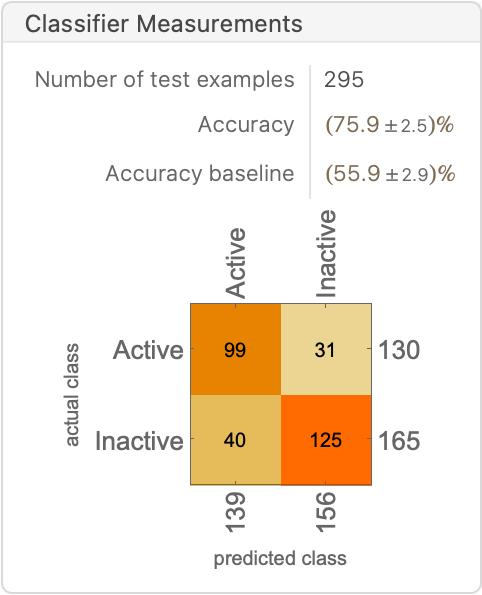
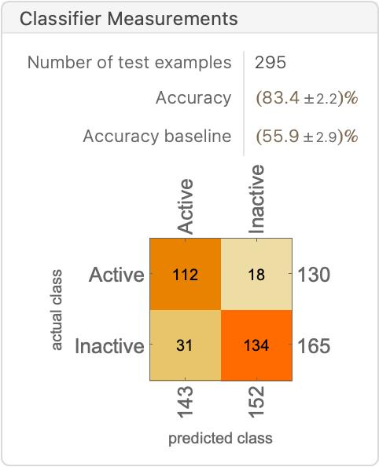
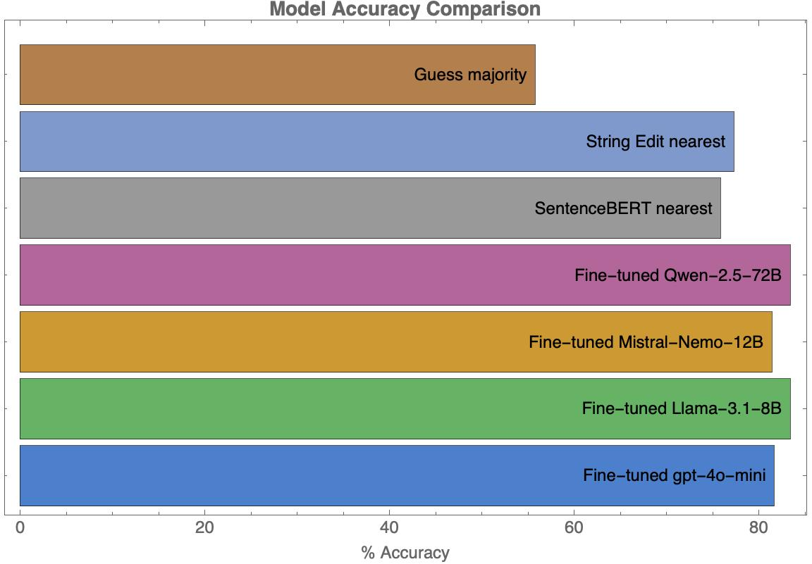

# AffinityNet

Motivated by Alzheimer’s disease research, particularly the role of β-amyloid (Aβ) plaques in cognitive decline, I am focusing on Beta-Secretase 1 (BACE1) as a therapeutic target. Designing effective BACE1 inhibitors presents challenges, such as achieving selectivity and crossing the blood-brain barrier. Inspired by the findings in [this](https://pubs.acs.org/doi/10.1021/acs.jcim.6b00290) paper, I plan to use the following curated dataset of 1,475 BACE1 inhibitors to improve classification of compound activity based on a threshold (IC50 ≤ 100 nM for “active” and >100 nM for “inactive"). 

This project uses the following [BACE (β-secretase enzyme)](https://raw.githubusercontent.com/deepchem/deepchem/refs/heads/master/datasets/rev8020split_desc.csv) dataset, predicting binding affinities given only the chemical structures describing the molecule: e.g., `Clc1cnc(C(=O)Nc2cc3C4(N=C(N)OC4)CCc3cc2)cc1 -> Active`.  

Motivated by literature on [solid-state chemistry predictions using fine-tuned LLMs](https://doi.org/10.1021/jacs.4c05840) and [text embedding vectors](https://dx.doi.org/10.26434/chemrxiv-2024-ltncz), I will try to see how much can be learned directly from the formula strings. We will compare (6) six different methods:
- [String Edit ('Levenshtein') Distance](https://en.wikipedia.org/wiki/Levenshtein_distance)
- [SentenceBERT semantic similarity](https://arxiv.org/abs/1908.10084)
- Fine-tuned [Llama](https://www.llama.com)-3.1-8B LLM
- Fine-tuned [gpt-4o-mini](https://platform.openai.com/docs/models/gpt-4o-mini) LLM
- Fine-tuned [Mistral-Nemo](https://mistral.ai/)-3.1-12B LLM
- Fine-tuned [Qwen](https://qwenlm.github.io/)-2.5-72B LLM

# Data Overview

The data was provided as an XLSX file (`data/BETA-1.xlsx`), where the binding affinitys are measured in pIC50.

The script `scripts/01_Data_preparation.wls` converts this to the corresponding level of activity, and performs a  80/20% train/test split of the data based on previous research. (There are 1180 training items and 295 test items.)  It also does some visualization of the dataset.

# Modeling Methods & Results

For reference, the most common class is "Active" binding affinity, and if you select this majority class all the time, you will be correct ~56% of the time.

## String Edit Distance

Relevant code is in `scripts/05_Edit_Distance.wls`.  In short, we compute the [Levenshtein edit distance](https://reference.wolfram.com/language/ref/EditDistance.html) between the a query chemical structure and the examples in the training set, and select the nearest one.  The premise here is that similar formulas should have similar results. This gives surprisingly high accuracy of 77%.

## SentenceBERT vector similarity

Next, we examined encoding the chemical formulas using [SentenceBERT](https://arxiv.org/abs/1908.10084). Naively, we don't expect this to be amazing, as SentenceBERT is really more about semantic meaning of general text, but it is easy enough to do. Implementation is in `scripts/02_SentenceBert_Similarity.wls`

Using the nearest similarity example yields the best results (comparable, maybe slightly better than string edit distance):

We can also look at the commonest label for the 10 nearest items:

**Possible improvements:**
- Use a different/better similarity function
- Tune the number of nearest-neighbors to consider

## Fine-tuned LLM models (Lllama 3.1-8B and GPT-40-mini) 

What about fine-tuning LLMs on this?  We use the system prompt: `You are a cheminformatics expert predicting the activity state of a molecule based on its chemical structure. Answer only with the following activity states and no other output: Active, Inactive.`

The molecular structure is provided as the user content and the activity level is the agent response.  We fine-tuned this on [Openpipe](https://openpipe.ai) using default hyperparameters, then downloaded the evaluated results.

The two fine-tuned LLMs are comparable (84-85% accuracy), which is a noticeable improvement upon using the edit distance/string similarity. Not bad for a chatbot! 

Fine-tuning Llama-3.1 model cost $2.48 USD;  I've put the LoRA BF16 weights in `models`.

Fine-tuning gpt-4o-mini model cost $2.22 USD.  You'll have to make your own, if you want to reproduce this, but you can do it easily using the `data/train.jsonl` file.

### Llama-3.1-8b

### GPT-4o-mini

**Possible improvements:**
- Play with fine-tuning hyperparameters and prompt
- Perform a cross-validation to assess error bars
- Examine the log-probabilities of output, evaluate perplexity, etc.

# Conclusions and Future Directions

It is possible to predict binding affinities for inhibitors given its chemical structure with reasonable accuracy using these text-based approaches. Additionally, adopting a text based approach may be more natural for scientific users.

